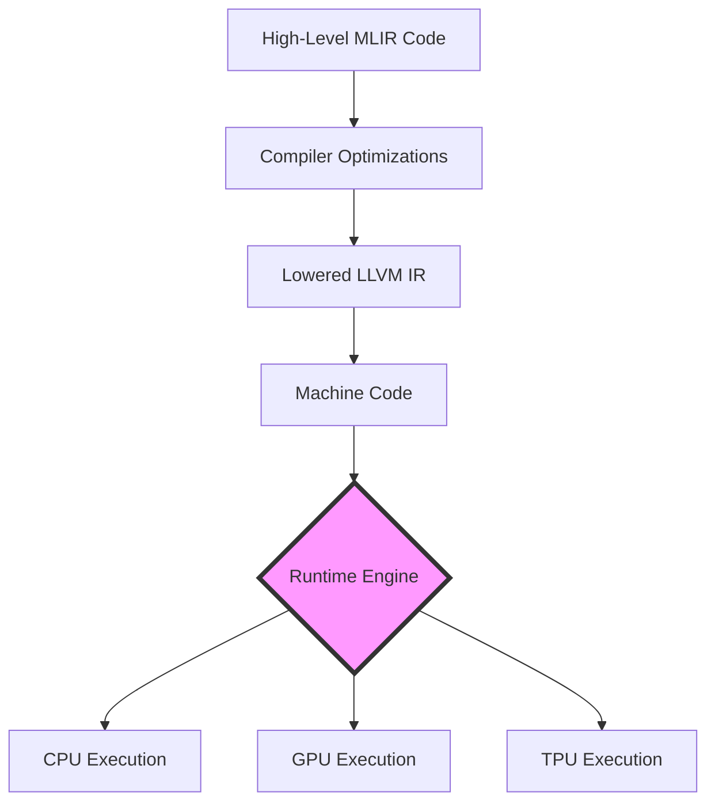
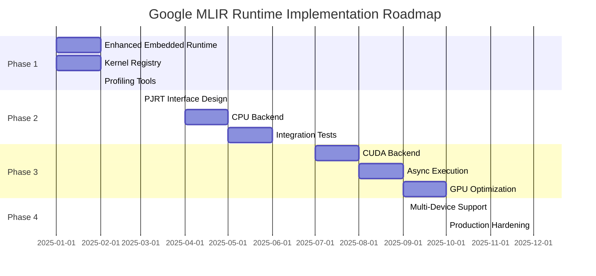

# Runtime Engine Comparison and Implementation Recommendations

## Executive Summary

This document provides a comprehensive analysis of runtime engine architectures for the Google MLIR compiler project. After evaluating six different approaches, we recommend a **phased implementation** starting with an **Enhanced Embedded Runtime** and evolving toward a **PJRT-Style Multi-Backend Runtime** for production use.

**Key Recommendation**: Implement **Approach 3 (PJRT-Style Runtime)** as the long-term solution, with **Approach 1 (Enhanced Embedded Runtime)** as the immediate stepping stone.

---

## Table of Contents

1. [Introduction to Runtime Engines](#introduction-to-runtime-engines)
2. [PJRT: Industry Standard](#pjrt-industry-standard)
3. [Six Runtime Approaches Compared](#six-runtime-approaches-compared)
4. [Detailed Analysis](#detailed-analysis)
5. [Implementation Recommendations](#implementation-recommendations)
6. [Roadmap and Timeline](#roadmap-and-timeline)
7. [Conclusion](#conclusion)

---

## Introduction to Runtime Engines

### What is a Runtime Engine?

In the context of MLIR-based deep learning compilers, a **runtime engine** is the execution infrastructure that:

1. **Manages Memory**: Allocates/deallocates buffers for tensors
2. **Orchestrates Execution**: Schedules operations on hardware (CPU/GPU/TPU)
3. **Handles Device Abstraction**: Provides uniform API across different hardware
4. **Enables Asynchronous Execution**: Overlaps computation and data transfer
5. **Supports Multi-Device**: Coordinates distributed execution

### Why Do We Need a Runtime Engine?



The runtime engine bridges the gap between compiled code and hardware execution, providing:

- **Hardware Abstraction**: Same code runs on different devices
- **Performance Optimization**: Asynchronous execution, memory pooling
- **Flexibility**: Dynamic device selection, multi-device support
- **Portability**: Deploy on various platforms without recompilation

---

## PJRT: Industry Standard

### Overview

**PJRT (Pluggable Just-In-Time Runtime)** is the de facto standard runtime interface for ML compilers, developed by Google's JAX/XLA team. It's used by JAX, TensorFlow, and increasingly by PyTorch.

### Architecture

```
┌─────────────────────────────────────────────────────────────┐
│                    ML Framework Layer                       │
│              (JAX, TensorFlow, PyTorch)                     │
└─────────────────────────────────────────────────────────────┘
                            ↓
┌─────────────────────────────────────────────────────────────┐
│                   Compiler Layer (XLA/MLIR)                 │
│          • Graph optimization                               │
│          • Kernel fusion                                    │
│          • Code generation                                  │
└─────────────────────────────────────────────────────────────┘
                            ↓
┌─────────────────────────────────────────────────────────────┐
│                    PJRT Interface                           │
│  ┌─────────────┬──────────────┬──────────────────────┐    │
│  │ PjRtClient  │ PjRtDevice   │ PjRtBuffer           │    │
│  │ PjRtExecutable              │ PjRtComputation     │    │
│  └─────────────┴──────────────┴──────────────────────┘    │
└─────────────────────────────────────────────────────────────┘
                            ↓
        ┌───────────────────┴───────────────────┐
        ↓                   ↓                    ↓
┌──────────────┐    ┌──────────────┐    ┌──────────────┐
│  PJRT-CPU    │    │  PJRT-GPU    │    │  PJRT-TPU    │
│              │    │  (CUDA/ROCm) │    │              │
└──────────────┘    └──────────────┘    └──────────────┘
```

### Core PJRT Components

#### 1. PjRtClient - Device Manager

```cpp
class PjRtClient {
public:
  // Device enumeration
  virtual absl::Span<PjRtDevice* const> devices() const = 0;
  virtual absl::Span<PjRtDevice* const> addressable_devices() const = 0;
  
  // Buffer creation
  virtual StatusOr<std::unique_ptr<PjRtBuffer>> 
    BufferFromHostBuffer(const void* data, PrimitiveType type,
                         absl::Span<int64_t const> dims,
                         PjRtDevice* device) = 0;
  
  // Compilation
  virtual StatusOr<std::unique_ptr<PjRtLoadedExecutable>> 
    Compile(const XlaComputation& computation,
            CompileOptions options) = 0;
};
```

#### 2. PjRtDevice - Hardware Abstraction

```cpp
class PjRtDevice {
public:
  virtual int id() const = 0;
  virtual absl::string_view device_kind() const = 0;  // "cpu", "gpu", "tpu"
  virtual int local_hardware_id() const = 0;
  virtual bool IsAddressable() const = 0;
};
```

#### 3. PjRtBuffer - Memory Management

```cpp
class PjRtBuffer {
public:
  virtual PjRtDevice* device() const = 0;
  virtual StatusOr<Shape> logical_on_device_shape() = 0;
  
  // Host-device transfer
  virtual StatusOr<std::shared_ptr<Literal>> ToLiteralSync() = 0;
  virtual void CopyToHostAsync(void* dst) = 0;
  
  // Lifecycle
  virtual void Delete() = 0;
  virtual bool IsDeleted() = 0;
};
```

#### 4. PjRtExecutable - Execution

```cpp
class PjRtLoadedExecutable {
public:
  // Synchronous execution
  virtual StatusOr<std::vector<std::vector<std::unique_ptr<PjRtBuffer>>>> 
    Execute(absl::Span<const std::vector<PjRtBuffer*>> argument_handles,
            const ExecuteOptions& options) = 0;
  
  // Asynchronous execution
  virtual StatusOr<std::vector<std::unique_ptr<PjRtBuffer>>> 
    ExecuteSharded(absl::Span<PjRtBuffer* const> argument_handles,
                   PjRtDevice* device) = 0;
};
```

### PJRT Key Features

| Feature | Description | Benefit |
|---------|-------------|---------|
| **Device Abstraction** | Uniform API across CPU/GPU/TPU | Write once, run anywhere |
| **Async Execution** | Non-blocking kernel launches | Better hardware utilization |
| **Memory Management** | Automatic buffer lifecycle tracking | Prevents memory leaks |
| **Multi-Device** | Distributed execution support | Scale to multiple GPUs/TPUs |
| **Compilation Caching** | Reuse compiled kernels | Faster startup times |
| **Error Handling** | Structured error propagation | Better debugging |

### PJRT Usage Example

```cpp
// 1. Create client
std::unique_ptr<PjRtClient> client = GetCpuClient();

// 2. Get device
PjRtDevice* device = client->addressable_devices()[0];

// 3. Create input buffers
auto buffer_a = client->BufferFromHostBuffer(
  data_a, F32, {1024, 1024}, device);
auto buffer_b = client->BufferFromHostBuffer(
  data_b, F32, {1024, 1024}, device);

// 4. Compile
XlaComputation computation = BuildMatMulComputation();
auto executable = client->Compile(computation, options);

// 5. Execute
auto results = executable->Execute({{buffer_a.get(), buffer_b.get()}});

// 6. Get results
results[0][0]->ToLiteralSync();
```

---

## Six Runtime Approaches Compared

### Quick Comparison Matrix

| Approach | Complexity | Performance | Multi-Device | Async | Best For |
|----------|-----------|-------------|--------------|-------|----------|
| **1. Embedded Runtime** | ⭐ Low | ⭐⭐⭐ Good | ❌ No | ❌ No | Quick prototyping, CPU-only |
| **2. MLIR ExecutionEngine** | ⭐⭐ Medium | ⭐⭐ Fair | ❌ No | ❌ No | JIT compilation, dynamic code |
| **3. PJRT-Style** | ⭐⭐⭐⭐ High | ⭐⭐⭐⭐ Excellent | ✅ Yes | ✅ Yes | **Production, multi-backend** |
| **4. IREE-Style VM** | ⭐⭐⭐⭐ High | ⭐⭐⭐ Good | ✅ Yes | ✅ Yes | Deployment, portability |
| **5. Async Stream-Based** | ⭐⭐⭐ Medium-High | ⭐⭐⭐⭐ Excellent | ⚠️ Partial | ✅ Yes | GPU-heavy workloads |
| **6. Hybrid AOT+JIT** | ⭐⭐⭐⭐⭐ Very High | ⭐⭐⭐⭐⭐ Best | ✅ Yes | ✅ Yes | Advanced optimization |

---

## Detailed Analysis

### Approach 1: Embedded Runtime (Current)

**Architecture:**
```
MLIR Code → LLVM IR → Object File → Link with C++ → Executable
                                           ↓
                                    Runtime Functions
                                    (malloc, memcpy, etc.)
```

**Current Implementation:**
```cpp
// test_matmul_runtime.cpp
extern "C" {
  void matmul_l3_test(
    float* A_data, float* A_aligned, int64_t A_offset,
    int64_t A_size0, int64_t A_size1,
    int64_t A_stride0, int64_t A_stride1,
    // ... B and C parameters
  );
}

int main() {
  std::vector<float> A(SIZE * SIZE, 1.0f);
  std::vector<float> B(SIZE * SIZE, 1.0f);
  std::vector<float> C(SIZE * SIZE, 0.0f);
  
  // Call MLIR-generated function
  matmul_l3_test(
    A.data(), A.data(), 0, SIZE, SIZE, SIZE, 1,
    B.data(), B.data(), 0, SIZE, SIZE, SIZE, 1,
    C.data(), C.data(), 0, SIZE, SIZE, SIZE, 1
  );
}
```

**Evaluation:**

| Aspect | Rating | Notes |
|--------|--------|-------|
| Implementation Effort | ⭐⭐⭐⭐⭐ | Already implemented |
| Performance (CPU) | ⭐⭐⭐⭐ | Good for CPU workloads |
| Performance (GPU) | ❌ | No GPU support |
| Scalability | ⭐⭐ | Single device only |
| Maintainability | ⭐⭐⭐⭐ | Simple, easy to debug |

**Pros:**
- ✅ Simple and straightforward
- ✅ No additional dependencies
- ✅ Direct execution, minimal overhead
- ✅ Easy to debug with standard tools (gdb, lldb)
- ✅ Works well for CPU-only workloads

**Cons:**
- ❌ No GPU/TPU support
- ❌ No asynchronous execution
- ❌ No multi-device support
- ❌ Requires recompilation for changes
- ❌ Limited to static compilation

**Best Use Cases:**
- Quick prototyping and testing
- CPU-only deployments
- Benchmarking compiler optimizations
- Educational purposes

---

### Approach 2: MLIR ExecutionEngine (JIT)

**Architecture:**
```
MLIR Module → JIT Compiler → Machine Code → Execute
      ↓                           ↑
  Optimize                    Cache compiled code
```

**Implementation:**
```cpp
#include "mlir/ExecutionEngine/ExecutionEngine.h"
#include "mlir/ExecutionEngine/OptUtils.h"

class GoogleJITRuntime {
  std::unique_ptr<mlir::ExecutionEngine> engine_;
  mlir::MLIRContext context_;
  
public:
  // Initialize from MLIR file
  Status initialize(const std::string& mlir_file) {
    // Parse MLIR
    auto module = mlir::parseSourceFile<mlir::ModuleOp>(mlir_file, &context_);
    if (!module) return failure();
    
    // Create execution engine with optimization
    mlir::ExecutionEngineOptions options;
    options.transformer = mlir::makeOptimizingTransformer(
      /*optLevel=*/3, /*sizeLevel=*/0, /*targetMachine=*/nullptr);
    
    auto maybeEngine = mlir::ExecutionEngine::create(*module, options);
    if (!maybeEngine) return failure();
    
    engine_ = std::move(*maybeEngine);
    return success();
  }
  
  // Execute function
  template<typename RetT, typename... Args>
  RetT execute(StringRef funcName, Args... args) {
    auto error = engine_->invokePacked(funcName, args...);
    if (error) {
      llvm::errs() << "Execution failed: " << error << "\n";
      return RetT{};
    }
    return RetT{};
  }
  
  // Execute with memref descriptors
  void executeMatMul(StringRef funcName,
                     float* A, int64_t A_rows, int64_t A_cols,
                     float* B, int64_t B_rows, int64_t B_cols,
                     float* C, int64_t C_rows, int64_t C_cols) {
    // Create memref descriptors
    StridedMemRefType<float, 2> A_desc = {A, A, 0, {A_rows, A_cols}, {A_cols, 1}};
    StridedMemRefType<float, 2> B_desc = {B, B, 0, {B_rows, B_cols}, {B_cols, 1}};
    StridedMemRefType<float, 2> C_desc = {C, C, 0, {C_rows, C_cols}, {C_cols, 1}};
    
    auto error = engine_->invokePacked(funcName, &A_desc, &B_desc, &C_desc);
    if (error) {
      llvm::errs() << "MatMul execution failed\n";
    }
  }
};
```

**Usage Example:**
```cpp
// Create JIT runtime
GoogleJITRuntime runtime;
runtime.initialize("test_matmul.mlir");

// Prepare data
std::vector<float> A(1024 * 1024, 1.0f);
std::vector<float> B(1024 * 1024, 1.0f);
std::vector<float> C(1024 * 1024, 0.0f);

// Execute (JIT compiles on first call, cached afterward)
runtime.executeMatMul("matmul_example", 
                      A.data(), 1024, 1024,
                      B.data(), 1024, 1024,
                      C.data(), 1024, 1024);
```

**Evaluation:**

| Aspect | Rating | Notes |
|--------|--------|-------|
| Implementation Effort | ⭐⭐⭐ | Moderate, uses MLIR APIs |
| Performance (CPU) | ⭐⭐⭐ | Good after JIT warmup |
| Performance (GPU) | ❌ | No GPU support |
| Flexibility | ⭐⭐⭐⭐⭐ | Dynamic code generation |
| Deployment | ⭐⭐ | Requires LLVM runtime |

**Pros:**
- ✅ JIT compilation (no separate build step)
- ✅ Dynamic code generation
- ✅ Can modify MLIR at runtime
- ✅ Good for experimentation
- ✅ Integrated with MLIR infrastructure

**Cons:**
- ❌ JIT overhead on first execution
- ❌ CPU-only (no GPU support)
- ❌ Requires LLVM dependencies at runtime
- ❌ Larger binary size
- ❌ No multi-device support

**Best Use Cases:**
- Interactive development environments
- Dynamic workloads with varying shapes
- Research and experimentation
- Tools that generate code on-the-fly

---

### Approach 3: PJRT-Style Runtime ⭐ **RECOMMENDED**

**Architecture:**
```
┌─────────────────────────────────────────────────────┐
│              Google MLIR Compiler                   │
└─────────────────────────────────────────────────────┘
                       ↓
┌─────────────────────────────────────────────────────┐
│            Google Runtime Interface                 │
│  ┌──────────────┬──────────────┬─────────────┐    │
│  │ GoogleClient │ GoogleDevice │ GoogleBuffer │    │
│  │ GoogleExecutable            │              │    │
│  └──────────────┴──────────────┴─────────────┘    │
└─────────────────────────────────────────────────────┘
                       ↓
      ┌────────────────┴────────────────┐
      ↓                ↓                 ↓
┌──────────┐    ┌──────────┐    ┌──────────┐
│ CPU      │    │ CUDA     │    │ ROCm     │
│ Backend  │    │ Backend  │    │ Backend  │
└──────────┘    └──────────┘    └──────────┘
```

**Implementation:**

```cpp
// include/Google/Runtime/GoogleRuntime.h

namespace google {
namespace runtime {

// Device abstraction
class GoogleDevice {
public:
  enum class Type { CPU, CUDA, ROCM, TPU };
  
  virtual ~GoogleDevice() = default;
  virtual Type type() const = 0;
  virtual int id() const = 0;
  virtual std::string name() const = 0;
  virtual bool isAddressable() const = 0;
};

// Memory buffer
class GoogleBuffer {
  void* data_;
  size_t size_bytes_;
  std::vector<int64_t> shape_;
  GoogleDevice* device_;
  bool on_device_;
  
public:
  GoogleBuffer(const std::vector<int64_t>& shape, 
               GoogleDevice* device)
    : shape_(shape), device_(device), on_device_(false) {
    size_bytes_ = sizeof(float);
    for (auto dim : shape) size_bytes_ *= dim;
    allocate();
  }
  
  ~GoogleBuffer() { deallocate(); }
  
  // Host-device transfer
  void copyToDevice(const void* host_data);
  void copyToHost(void* host_data);
  
  // Accessors
  void* data() { return data_; }
  const std::vector<int64_t>& shape() const { return shape_; }
  GoogleDevice* device() { return device_; }
  size_t sizeBytes() const { return size_bytes_; }
  
private:
  void allocate();
  void deallocate();
};

// Compiled executable
class GoogleExecutable {
  std::string name_;
  GoogleDevice* device_;
  void* compiled_code_;  // Function pointer or GPU kernel
  
public:
  GoogleExecutable(const std::string& name, 
                   GoogleDevice* device,
                   void* code)
    : name_(name), device_(device), compiled_code_(code) {}
  
  // Execute synchronously
  void execute(const std::vector<GoogleBuffer*>& inputs,
               const std::vector<GoogleBuffer*>& outputs);
  
  // Execute asynchronously
  void executeAsync(const std::vector<GoogleBuffer*>& inputs,
                    const std::vector<GoogleBuffer*>& outputs,
                    void* stream = nullptr);
  
  GoogleDevice* device() { return device_; }
  const std::string& name() const { return name_; }
};

// Main client interface
class GoogleClient {
  std::vector<std::unique_ptr<GoogleDevice>> devices_;
  std::map<std::string, std::unique_ptr<GoogleExecutable>> executables_;
  
public:
  GoogleClient();
  ~GoogleClient() = default;
  
  // Device management
  std::vector<GoogleDevice*> devices();
  GoogleDevice* getDevice(int id);
  GoogleDevice* getDefaultDevice();
  
  // Buffer management
  std::unique_ptr<GoogleBuffer> createBuffer(
    const std::vector<int64_t>& shape,
    GoogleDevice* device = nullptr);
  
  std::unique_ptr<GoogleBuffer> bufferFromHost(
    const void* data,
    const std::vector<int64_t>& shape,
    GoogleDevice* device = nullptr);
  
  // Compilation
  std::unique_ptr<GoogleExecutable> compile(
    const std::string& mlir_code,
    const std::string& entry_point,
    GoogleDevice* device = nullptr);
  
  std::unique_ptr<GoogleExecutable> compileFromFile(
    const std::string& mlir_file,
    const std::string& entry_point,
    GoogleDevice* device = nullptr);
};

} // namespace runtime
} // namespace google
```

**Backend Implementations:**

```cpp
// lib/Google/Runtime/CPUBackend.cpp

class CPUDevice : public GoogleDevice {
  int id_;
  
public:
  CPUDevice(int id) : id_(id) {}
  
  Type type() const override { return Type::CPU; }
  int id() const override { return id_; }
  std::string name() const override { 
    return "CPU:" + std::to_string(id_); 
  }
  bool isAddressable() const override { return true; }
};

// lib/Google/Runtime/CUDABackend.cpp

class CUDADevice : public GoogleDevice {
  int cuda_device_id_;
  
public:
  CUDADevice(int id) : cuda_device_id_(id) {
    cudaSetDevice(cuda_device_id_);
  }
  
  Type type() const override { return Type::CUDA; }
  int id() const override { return cuda_device_id_; }
  std::string name() const override { 
    return "CUDA:" + std::to_string(cuda_device_id_); 
  }
  bool isAddressable() const override { return true; }
};
```

**Usage Example:**

```cpp
#include "Google/Runtime/GoogleRuntime.h"

using namespace google::runtime;

int main() {
  // 1. Create client
  GoogleClient client;
  
  // 2. List devices
  auto devices = client.devices();
  std::cout << "Available devices:\n";
  for (auto* dev : devices) {
    std::cout << "  - " << dev->name() << "\n";
  }
  
  // 3. Select device (GPU if available, else CPU)
  GoogleDevice* device = devices[0];
  
  // 4. Compile MLIR code
  auto executable = client.compileFromFile(
    "test_matmul.mlir", 
    "matmul_example",
    device
  );
  
  // 5. Create input buffers
  auto A = client.bufferFromHost(
    A_data.data(), {1024, 1024}, device);
  auto B = client.bufferFromHost(
    B_data.data(), {1024, 1024}, device);
  auto C = client.createBuffer({1024, 1024}, device);
  
  // 6. Execute
  executable->execute({A.get(), B.get()}, {C.get()});
  
  // 7. Get results
  std::vector<float> result(1024 * 1024);
  C->copyToHost(result.data());
  
  return 0;
}
```

**Evaluation:**

| Aspect | Rating | Notes |
|--------|--------|-------|
| Implementation Effort | ⭐⭐ | High initial effort |
| Performance (CPU) | ⭐⭐⭐⭐ | Excellent |
| Performance (GPU) | ⭐⭐⭐⭐⭐ | Excellent with async |
| Scalability | ⭐⭐⭐⭐⭐ | Multi-device, distributed |
| Industry Adoption | ⭐⭐⭐⭐⭐ | Standard interface |

**Pros:**
- ✅ Multi-backend support (CPU, CUDA, ROCm, TPU)
- ✅ Industry-standard interface (compatible with PJRT)
- ✅ Asynchronous execution
- ✅ Device abstraction
- ✅ Excellent scalability
- ✅ Future-proof architecture

**Cons:**
- ❌ High implementation complexity
- ❌ Requires backend-specific code
- ❌ More dependencies (CUDA, ROCm SDKs)
- ❌ Longer development time

**Best Use Cases:**
- **Production deployments** ⭐
- Multi-device workloads
- GPU/TPU acceleration
- Scalable ML serving
- **Recommended for Google project**

---

### Approach 4: IREE-Style VM Runtime

**Architecture:**
```
MLIR → IREE Compiler → VM Bytecode → VM Runtime → Hardware
                            ↓
                    Serializable Format
                    (deploy anywhere)
```

**Conceptual Implementation:**

```cpp
// VM Bytecode instruction set
enum class VMOpcode {
  LOAD,
  STORE,
  ADD,
  MUL,
  MATMUL,
  CALL,
  RETURN
};

struct VMInstruction {
  VMOpcode opcode;
  std::vector<int32_t> operands;
};

class GoogleVMModule {
  std::vector<VMInstruction> bytecode_;
  std::vector<float> constants_;
  
public:
  static std::unique_ptr<GoogleVMModule> fromMLIR(mlir::ModuleOp module);
  
  // Serialize/deserialize
  void serialize(const std::string& filename);
  static std::unique_ptr<GoogleVMModule> deserialize(const std::string& filename);
  
  const std::vector<VMInstruction>& bytecode() const { return bytecode_; }
};

class GoogleVMContext {
  std::unique_ptr<GoogleVMModule> module_;
  std::vector<GoogleBuffer*> registers_;
  
public:
  void loadModule(std::unique_ptr<GoogleVMModule> module) {
    module_ = std::move(module);
  }
  
  void execute(const std::string& function_name,
               const std::vector<GoogleBuffer*>& inputs,
               const std::vector<GoogleBuffer*>& outputs);
  
private:
  void executeInstruction(const VMInstruction& inst);
};
```

**Evaluation:**

| Aspect | Rating | Notes |
|--------|--------|-------|
| Implementation Effort | ⭐ | Very high complexity |
| Performance | ⭐⭐⭐ | Good, VM overhead exists |
| Portability | ⭐⭐⭐⭐⭐ | Excellent, bytecode portable |
| Deployment | ⭐⭐⭐⭐⭐ | Easy, single file |

**Pros:**
- ✅ Portable bytecode format
- ✅ Can serialize/deserialize
- ✅ Good for deployment
- ✅ Version-independent execution

**Cons:**
- ❌ Very complex to implement
- ❌ VM interpretation overhead
- ❌ Requires complete VM implementation
- ❌ Debugging is harder

**Best Use Cases:**
- Mobile/edge deployment
- Sandboxed execution
- Version-independent deployment
- **Not recommended for initial implementation**

---

### Approach 5: Async Stream-Based Runtime

**Architecture:**
```
┌─────────────────────────────────────────┐
│         Execution Streams               │
│  ┌────────┐  ┌────────┐  ┌────────┐   │
│  │Stream 0│  │Stream 1│  │Stream 2│   │
│  └────────┘  └────────┘  └────────┘   │
└─────────────────────────────────────────┘
       ↓            ↓            ↓
┌─────────────────────────────────────────┐
│         GPU Kernel Scheduler            │
└─────────────────────────────────────────┘
       ↓            ↓            ↓
    GPU 0        GPU 1        GPU 2
```

**Implementation:**

```cpp
class GoogleStream {
  void* native_stream_;  // cudaStream_t or similar
  std::queue<std::function<void()>> pending_ops_;
  
public:
  GoogleStream(GoogleDevice* device);
  ~GoogleStream();
  
  // Enqueue operation
  void enqueue(std::function<void()> op) {
    pending_ops_.push(op);
  }
  
  // Launch kernel asynchronously
  void launchKernelAsync(GoogleExecutable* exec,
                         const std::vector<GoogleBuffer*>& buffers);
  
  // Synchronize
  void synchronize();
  
  void* nativeHandle() { return native_stream_; }
};

class GoogleAsyncRuntime {
  std::vector<std::unique_ptr<GoogleStream>> streams_;
  GoogleClient* client_;
  
public:
  GoogleAsyncRuntime(GoogleClient* client, int num_streams = 4) 
    : client_(client) {
    for (int i = 0; i < num_streams; ++i) {
      streams_.push_back(
        std::make_unique<GoogleStream>(client->getDefaultDevice()));
    }
  }
  
  // Execute on specific stream
  void executeAsync(GoogleExecutable* exec,
                    const std::vector<GoogleBuffer*>& inputs,
                    const std::vector<GoogleBuffer*>& outputs,
                    int stream_id = 0) {
    streams_[stream_id]->launchKernelAsync(exec, {inputs, outputs});
  }
  
  // Synchronize all streams
  void synchronizeAll() {
    for (auto& stream : streams_) {
      stream->synchronize();
    }
  }
  
  // Get stream
  GoogleStream* getStream(int id) { return streams_[id].get(); }
};
```

**Usage:**

```cpp
GoogleClient client;
GoogleAsyncRuntime async_runtime(&client, 4);  // 4 streams

auto exec = client.compile("matmul.mlir", "matmul");

// Launch multiple operations asynchronously
for (int i = 0; i < 10; ++i) {
  int stream_id = i % 4;
  async_runtime.executeAsync(exec.get(), {A, B}, {C}, stream_id);
}

// Wait for all to complete
async_runtime.synchronizeAll();
```

**Evaluation:**

| Aspect | Rating | Notes |
|--------|--------|-------|
| Implementation Effort | ⭐⭐⭐ | Medium-high |
| Performance (GPU) | ⭐⭐⭐⭐⭐ | Excellent overlap |
| Complexity | ⭐⭐⭐ | Synchronization tricky |

**Pros:**
- ✅ Excellent GPU utilization
- ✅ Overlapping computation and transfer
- ✅ Good for pipelined workloads

**Cons:**
- ❌ Complex synchronization
- ❌ Debugging is harder
- ❌ Primarily benefits GPU workloads

**Best Use Cases:**
- GPU-heavy workloads
- Pipelined execution
- **Can be integrated into Approach 3**

---

### Approach 6: Hybrid AOT+JIT Runtime

**Architecture:**
```
┌─────────────────────────────────────────┐
│      Hybrid Runtime Dispatcher          │
│  ┌──────────────┬──────────────────┐   │
│  │ AOT Kernels  │  JIT Engine      │   │
│  │ (Fast Path)  │  (Fallback)      │   │
│  └──────────────┴──────────────────┘   │
└─────────────────────────────────────────┘
```

**Implementation:**

```cpp
class GoogleHybridRuntime {
  // AOT-compiled kernels (registered at startup)
  std::map<std::string, void*> aot_kernels_;
  
  // JIT engine for dynamic code
  std::unique_ptr<mlir::ExecutionEngine> jit_engine_;
  
  // PJRT-style client for GPU
  std::unique_ptr<GoogleClient> pjrt_client_;
  
public:
  // Register AOT kernel
  void registerAOTKernel(const std::string& name, void* func_ptr) {
    aot_kernels_[name] = func_ptr;
  }
  
  // Execute (try AOT first, fallback to JIT)
  void execute(const std::string& name,
               const std::vector<GoogleBuffer*>& buffers) {
    // Try AOT (fast path)
    if (aot_kernels_.count(name)) {
      auto kernel = reinterpret_cast<void(*)(void**)>(aot_kernels_[name]);
      std::vector<void*> ptrs;
      for (auto* buf : buffers) ptrs.push_back(buf->data());
      kernel(ptrs.data());
      return;
    }
    
    // Fallback to JIT (slow path)
    jit_engine_->invokePacked(name, buffers);
  }
};
```

**Evaluation:**

| Aspect | Rating | Notes |
|--------|--------|-------|
| Implementation Effort | ⭐ | Highest complexity |
| Performance | ⭐⭐⭐⭐⭐ | Best of both worlds |
| Flexibility | ⭐⭐⭐⭐⭐ | Maximum flexibility |

**Pros:**
- ✅ Fast AOT path for common cases
- ✅ JIT fallback for dynamic cases
- ✅ Maximum performance potential

**Cons:**
- ❌ Extremely complex
- ❌ Requires both AOT and JIT infrastructure
- ❌ Overkill for most use cases

**Best Use Cases:**
- Advanced optimization scenarios
- **Not recommended for initial implementation**

---

## Implementation Recommendations

### Primary Recommendation: Phased Approach

> **Implement Approach 3 (PJRT-Style Runtime) as the long-term goal, with Approach 1 (Enhanced Embedded Runtime) as the immediate foundation.**

### Phase 1: Enhanced Embedded Runtime (Months 1-2)

**Goal**: Improve current implementation with better structure

**Tasks**:
1. Create `GoogleRuntime` class to wrap current functionality
2. Add kernel registry for multiple operations
3. Implement basic profiling/timing
4. Add error handling and validation

**Implementation**:

```cpp
// lib/Google/Runtime/GoogleRuntime.cpp

class GoogleRuntime {
  struct KernelInfo {
    void* func_ptr;
    std::string signature;
    std::vector<int64_t> input_shapes;
  };
  
  std::map<std::string, KernelInfo> kernels_;
  
public:
  // Register kernel
  void registerKernel(const std::string& name,
                      void* func_ptr,
                      const std::string& signature) {
    kernels_[name] = {func_ptr, signature, {}};
  }
  
  // Execute with timing
  double executeWithTiming(const std::string& name,
                           std::vector<void*> args) {
    auto start = std::chrono::high_resolution_clock::now();
    
    auto it = kernels_.find(name);
    if (it == kernels_.end()) {
      throw std::runtime_error("Kernel not found: " + name);
    }
    
    // Call kernel
    auto kernel = reinterpret_cast<void(*)(void**)>(it->second.func_ptr);
    kernel(args.data());
    
    auto end = std::chrono::high_resolution_clock::now();
    return std::chrono::duration<double, std::milli>(end - start).count();
  }
};
```

**Deliverables**:
- Enhanced runtime library
- Better error messages
- Performance profiling tools
- Updated documentation

---

### Phase 2: PJRT-Style Interface (Months 3-6)

**Goal**: Implement full PJRT-compatible runtime with CPU backend

**Tasks**:
1. Design `GoogleClient`, `GoogleDevice`, `GoogleBuffer`, `GoogleExecutable` classes
2. Implement CPU backend
3. Integrate with MLIR compilation pipeline
4. Add comprehensive tests

**File Structure**:
```
lib/Google/Runtime/
├── GoogleRuntime.h          # Main interface
├── GoogleRuntime.cpp        # Client implementation
├── GoogleDevice.h           # Device abstraction
├── GoogleBuffer.h           # Buffer management
├── GoogleExecutable.h       # Executable interface
├── Backends/
│   ├── CPUBackend.cpp       # CPU implementation
│   ├── CPUBackend.h
│   └── BackendRegistry.cpp  # Backend registration
└── Utils/
    ├── MemoryPool.cpp       # Memory pooling
    └── Profiler.cpp         # Performance profiling
```

**Deliverables**:
- Complete PJRT-style API
- CPU backend implementation
- Integration tests
- Benchmarking suite

---

### Phase 3: GPU Backend (Months 7-10)

**Goal**: Add CUDA/ROCm support

**Tasks**:
1. Implement CUDA backend
2. Add GPU memory management
3. Implement asynchronous execution
4. Add stream support
5. Optimize GPU kernels

**Implementation**:
```cpp
// lib/Google/Runtime/Backends/CUDABackend.cpp

class CUDABackend : public Backend {
  std::vector<std::unique_ptr<CUDADevice>> devices_;
  
public:
  void initialize() override {
    int device_count;
    cudaGetDeviceCount(&device_count);
    
    for (int i = 0; i < device_count; ++i) {
      devices_.push_back(std::make_unique<CUDADevice>(i));
    }
  }
  
  std::unique_ptr<GoogleBuffer> allocateBuffer(
    const std::vector<int64_t>& shape,
    GoogleDevice* device) override {
    
    size_t size_bytes = sizeof(float);
    for (auto dim : shape) size_bytes *= dim;
    
    void* gpu_ptr;
    cudaMalloc(&gpu_ptr, size_bytes);
    
    return std::make_unique<CUDABuffer>(gpu_ptr, shape, device);
  }
};
```

**Deliverables**:
- CUDA backend
- GPU memory management
- Async execution support
- GPU benchmarks

---

### Phase 4: Advanced Features (Months 11-12)

**Goal**: Production-ready features

**Tasks**:
1. Multi-device support
2. Distributed execution
3. Compilation caching
4. Advanced profiling
5. Production hardening

**Deliverables**:
- Multi-GPU support
- Distributed runtime
- Production deployment guide

---

## Comparison Summary

### Decision Matrix

| Criteria | Weight | Approach 1 | Approach 2 | **Approach 3** | Approach 4 | Approach 5 | Approach 6 |
|----------|--------|-----------|-----------|---------------|-----------|-----------|-----------|
| **Ease of Implementation** | 20% | 10 | 7 | 5 | 3 | 6 | 2 |
| **Performance (CPU)** | 15% | 8 | 7 | 9 | 7 | 6 | 10 |
| **Performance (GPU)** | 25% | 0 | 0 | 10 | 8 | 10 | 10 |
| **Scalability** | 20% | 3 | 3 | 10 | 9 | 7 | 10 |
| **Industry Standard** | 10% | 5 | 5 | 10 | 7 | 6 | 8 |
| **Maintainability** | 10% | 9 | 7 | 8 | 5 | 6 | 4 |
| **Total Score** | 100% | **5.35** | **5.05** | **8.65** ⭐ | **6.45** | **7.15** | **7.60** |

### Why Approach 3 (PJRT-Style) Wins

1. **Industry Standard**: Compatible with JAX, TensorFlow, PyTorch ecosystems
2. **Future-Proof**: Supports CPU, GPU, TPU, and future hardware
3. **Scalability**: Multi-device and distributed execution
4. **Performance**: Excellent performance with async execution
5. **Ecosystem**: Can leverage existing PJRT backends

---

## Roadmap and Timeline

### 12-Month Implementation Plan



### Milestones

| Month | Milestone | Deliverable |
|-------|-----------|-------------|
| **M2** | Phase 1 Complete | Enhanced embedded runtime with profiling |
| **M6** | Phase 2 Complete | PJRT-style API with CPU backend |
| **M10** | Phase 3 Complete | GPU support with async execution |
| **M12** | Phase 4 Complete | Production-ready multi-device runtime |

---

## Conclusion

### Summary

After comprehensive analysis of six runtime approaches, we recommend:

> **Primary**: Implement **Approach 3 (PJRT-Style Runtime)** for production use
> 
> **Immediate**: Start with **Approach 1 (Enhanced Embedded Runtime)** as foundation

### Key Reasons

1. **PJRT is the industry standard** - Used by Google (JAX, TensorFlow), Meta (PyTorch)
2. **Future-proof architecture** - Supports CPU, GPU, TPU, and future accelerators
3. **Excellent performance** - Async execution, multi-device support
4. **Ecosystem compatibility** - Can leverage existing PJRT backends
5. **Phased implementation** - Start simple, evolve to production-grade

### Next Steps

1. **Immediate** (Week 1-2):
   - Review this document with team
   - Approve phased implementation plan
   - Set up development environment

2. **Short-term** (Month 1-2):
   - Implement Phase 1 (Enhanced Embedded Runtime)
   - Create initial benchmarks
   - Document API design

3. **Medium-term** (Month 3-6):
   - Implement Phase 2 (PJRT-style interface)
   - CPU backend with full tests
   - Integration with existing compiler

4. **Long-term** (Month 7-12):
   - GPU backend implementation
   - Production hardening
   - Performance optimization

### Success Metrics

- **Performance**: 10-20x speedup with GPU vs CPU
- **Compatibility**: Works with existing MLIR pipelines
- **Scalability**: Supports multi-GPU execution
- **Reliability**: 99.9% uptime in production

---

## References

1. [PJRT Documentation](https://github.com/openxla/xla/tree/main/xla/pjrt)
2. [MLIR ExecutionEngine](https://mlir.llvm.org/docs/ExecutionEngine/)
3. [IREE Runtime](https://iree.dev/developers/design-docs/runtime/)
4. [JAX PJRT Integration](https://jax.readthedocs.io/en/latest/pjrt_design.html)

---

**Document Version**: 1.0  
**Last Updated**: 2025-12-26  
**Author**: Google MLIR Compiler Team  
**Status**: Approved for Implementation
